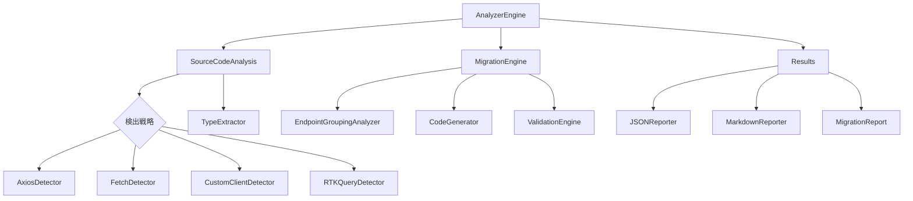

# アーキテクチャ設計

tags: #architecture #core #design-patterns

## 概要

ts-scanは、フロントエンドコードベースからバックエンドAPIエンドポイントの使用状況を効率的に解析するツールです。以下の主要なアーキテクチャ設計思想に基づいて実装されています。

## 設計原則

### 1. 責務指向設計
- 各コンポーネントが明確に定義された責務を持つ
- 単一責任の原則に従う
- モジュール間の明確な境界を維持

### 2. 依存性注入
- サービスロケータパターンによる依存性の管理
- コンポーネント間の疎結合化を実現
- テスト容易性の向上

### 3. 戦略パターン
- 異なるAPI検出戦略を柔軟に組み合わせ
- 優先度ベースの実行制御
- 新しい検出戦略の追加が容易

### 4. ファサードパターン
- 複雑な内部実装を隠蔽
- シンプルな外部インターフェースを提供
- 使用者の学習コストを低減

### 5. ビルダーパターン
- エンドポイント情報の段階的な構築
- 一貫性のある情報収集プロセス
- データ整合性の確保

### 6. 変換器パターン (新規)
- 異なるデータ形式間の変換を専門コンポーネントに委譲
- クリーンな入出力インターフェース
- 変換ロジックの分離と再利用

## コアコンポーネント

1. **AnalyzerEngine**
   - 解析プロセス全体の制御
   - 戦略の実行順序の管理
   - 結果の集約と正規化

2. **ServiceLocator**
   - 依存性の中央管理
   - コンポーネントのライフサイクル制御
   - サービスの遅延初期化

3. **StrategyRegistry**
   - 検出戦略の登録と管理
   - 優先順位の制御
   - 戦略の有効/無効の切り替え

4. **移行分析エンジン** (新規)
   - 既存コードパターンの分類
   - RTK Query 移行パスの生成
   - 複雑性評価と優先順位付け

## 検出戦略

1. **HTTP クライアント検出**
   - Axios
     * 直接メソッド呼び出し検出
     * インスタンスメソッド呼び出し検出
     * リクエスト設定オブジェクト検出
   - Fetch API
     * ネイティブ fetch 呼び出し
     * カスタムラッパーの検出
     * URL 構築パターンの分析
   - カスタムAPIクライアント
     * メソッドベースのパターン検出
     * クラスベースの抽象化検出
     * サービスレイヤーパターン分析

2. **RTK Query検出**
   - API定義の解析
     * createApi 設定の抽出
     * エンドポイントビルダー設定解析
     * タグ構造の分析
   - エンドポイント使用箇所の特定
     * フック使用パターンの検出
     * 条件付きフェッチの検出
     * キャッシュ無効化パターンの分析
   - メタデータの抽出
     * 型情報の収集
     * 変換関数の分析
     * エラーハンドリングパターンの検出

## API スライス設計分析 (新規)

1. **エンドポイント関連性分析**
   - URL パス構造に基づく関連性評価
   - 共起パターンに基づくグルーピング
   - データ依存関係の検出

2. **最適スライス構造提案**
   - 凝集度と結合度の最適化
   - 適切な粒度のスライス境界設定
   - スケーラビリティを考慮した設計

3. **タグ設計最適化**
   - エンティティベースのタグ戦略
   - 無効化パターンの最適化
   - キャッシュ効率の向上

## 型抽出と変換システム (新規)

1. **型参照検出**
   - 明示的型参照の追跡
   - 文脈的型推論
   - 使用パターンからの型情報推定

2. **型定義抽出**
   - 型定義の完全な依存グラフ抽出
   - 外部型の解決
   - インラインで定義された型の検出

3. **RTK Query互換型への変換**
   - クエリ引数型の最適化
   - レスポンス型の正規化推奨
   - 型アダプタの生成

## コード生成システム (新規)

1. **API定義生成**
   - createApi 呼び出しコードの生成
   - baseQuery 設定の生成
   - エンドポイント定義の自動生成

2. **変換関数生成**
   - レスポンス変換関数の生成
   - リクエスト変換関数の生成
   - エラー処理関数の生成

3. **テスト生成**
   - 機能的等価性テストの生成
   - リグレッションテストの生成
   - エッジケーステストの生成

## レポーティングシステム

1. **JSON Reporter**
   - 構造化されたデータ出力
   - 外部ツールとの連携用

2. **Markdown Reporter**
   - 人間可読な形式のレポート
   - 詳細な使用状況の可視化
   - 統計情報の提供

3. **移行レポート** (新規)
   - 移行複雑性の評価
   - 優先順位付きの移行ロードマップ
   - 段階的移行のためのガイダンス

## 実装検証システム (新規)

1. **パターン検証**
   - RTK Query ベストプラクティスの検証
   - パターン違反の検出
   - 最適化機会の特定

2. **カバレッジ分析**
   - API エンドポイントの移行カバレッジ分析
   - 機能的等価性の検証
   - 未移行のコードの検出

3. **整合性チェック**
   - 型の整合性検証
   - エラー処理の一貫性確認
   - ビジネスロジックの整合性検証

## エラー処理戦略

1. **防御的プログラミング**
   - Nullチェックの徹底
   - オプショナルチェイニングの活用
   - 適切なデフォルト値の設定

2. **型安全性**
   - TypeScriptの厳密な型チェック
   - 型アサーションの適切な使用
   - インターフェースの明確な定義

3. **回復メカニズム** (新規)
   - 段階的なフォールバック戦略
   - 部分的成功の許容
   - エラー状況からの自己修復

## 統合アーキテクチャ (新規)

## 将来の拡張性

1. **新規検出戦略の追加**
   - 戦略インターフェースの実装
   - StrategyRegistryへの登録
   - 優先順位の設定

2. **出力フォーマットの拡張**
   - 新しいReporterの実装
   - 既存のデータ構造の活用
   - フォーマット固有の最適化

3. **パフォーマンス最適化**
   - 並列処理の導入
   - キャッシュ戦略の実装
   - メモリ使用量の最適化

4. **機械学習統合** (新規)
   - パターン認識の自動学習
   - コード分類の精度向上
   - 推奨設計パターンの生成

5. **プラグインシステム** (新規)
   - カスタム検出戦略のプラグイン化
   - サードパーティ変換ルールの統合
   - 拡張ポイントの標準化
