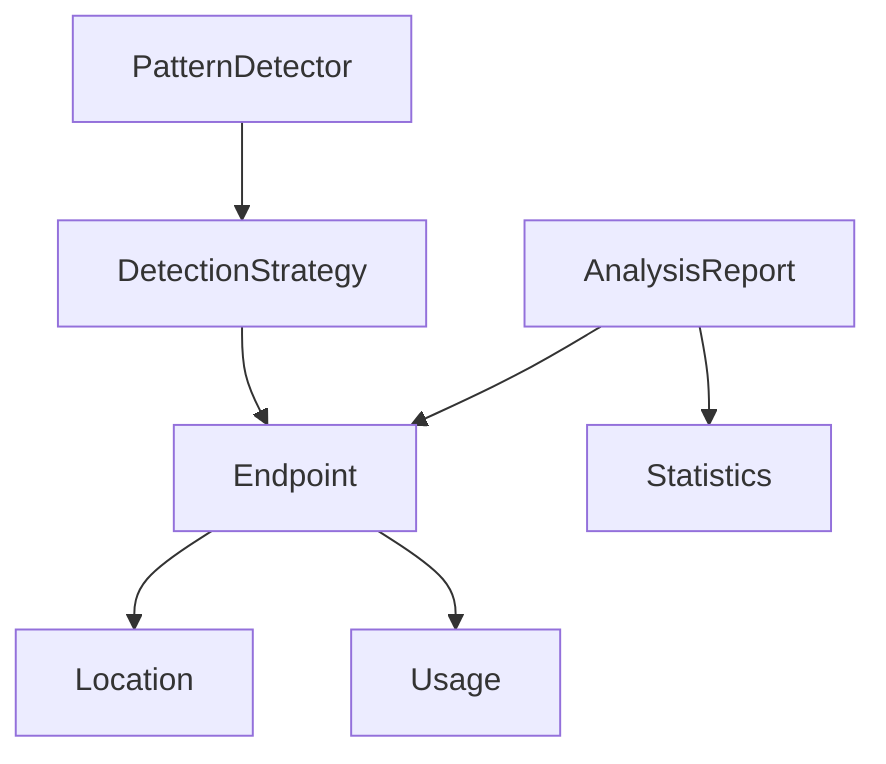

# ドメインモデル

tags: #domain-models #core-concepts #data-structures

## コアエンティティ

### Endpoint
APIエンドポイントを表現する中心的なエンティティ。

```typescript
interface Endpoint {
  path: string;          // エンドポイントのパス
  method: HttpMethod;    // HTTPメソッド
  location: Location;    // ソースコード上の位置
  parameters?: string[]; // URLパラメータ
  usage: Usage;         // 使用状況情報
}
```

### Location
ソースコード上の位置情報を表現。

```typescript
interface Location {
  filePath: string;    // ファイルパス
  line: number;        // 行番号
  column: number;      // 列番号
  context?: string;    // 周辺のコードコンテキスト
}
```

### Usage
エンドポイントの使用状況を表現。

```typescript
interface Usage {
  count: number;           // 使用回数
  patterns: string[];      // 検出されたパターン
  contexts: string[];      // 使用コンテキスト
  lastDetected: Date;      // 最終検出日時
}
```

## 戦略関連モデル

### DetectionStrategy
API使用箇所の検出戦略を定義。

```typescript
interface DetectionStrategy {
  name: string;                 // 戦略名
  priority: number;             // 優先順位
  detect(): Promise<Endpoint[]>;// 検出メソッド
  supports(file: string): boolean; // サポート判定
}
```

### PatternDetector
特定のパターンの検出を担当。

```typescript
interface PatternDetector {
  pattern: RegExp | string;  // 検出パターン
  detect(node: Node): boolean; // 検出ロジック
  extract(node: Node): any;   // 情報抽出
}
```

## レポート関連モデル

### AnalysisReport
解析結果全体を表現。

```typescript
interface AnalysisReport {
  summary: ReportSummary;    // 概要情報
  endpoints: Endpoint[];      // 検出エンドポイント
  statistics: Statistics;     // 統計情報
  metadata: ReportMetadata;  // メタデータ
}
```

### Statistics
統計情報を表現。

```typescript
interface Statistics {
  totalEndpoints: number;     // 総エンドポイント数
  methodDistribution: {       // HTTPメソッド分布
    [method: string]: number;
  };
  patternDistribution: {      // パターン分布
    [pattern: string]: number;
  };
}
```

## 値オブジェクト

### HttpMethod
HTTPメソッドを表現する列挙型。

```typescript
enum HttpMethod {
  GET = 'GET',
  POST = 'POST',
  PUT = 'PUT',
  PATCH = 'PATCH',
  DELETE = 'DELETE',
}
```

### DetectionPattern
検出パターンを表現する列挙型。

```typescript
enum DetectionPattern {
  AXIOS = 'AXIOS',
  FETCH = 'FETCH',
  RTK_QUERY = 'RTK_QUERY',
  CUSTOM_CLIENT = 'CUSTOM_CLIENT',
}
```

## 関係性



## バリデーションルール

### Endpoint
- pathは必須で、空文字列は不可
- methodは定義されたHTTPメソッドのいずれか
- locationは必須

### DetectionStrategy
- nameは必須で、一意である必要あり
- priorityは0以上の整数
- supportsメソッドは必ずboolean型を返す

### AnalysisReport
- summaryは必須
- endpointsは空配列可
- statisticsは必須

## イミュータビリティ

- すべてのモデルはイミュータブルとして扱う
- 変更が必要な場合は新しいインスタンスを生成
- Readonlyプロパティを積極的に活用
