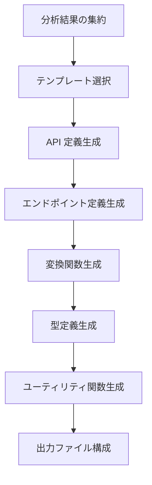

# 自動コード生成システム

tags: #rtk-query #code-generation #api-definition #transformation

## 概要

自動コード生成システムは、API 呼び出しパターンの分析結果、型情報、およびスライス設計に基づいて、完全な RTK Query 実装コードを生成するためのシステムです。最小限の手動調整で実際に使用可能な高品質のコードを生成し、開発者の移行作業を大幅に効率化します。

## アーキテクチャ



## コアコンポーネント

### 1. テンプレートエンジン

```typescript
interface TemplateEngine {
  /**
   * 適切なテンプレートの選択
   */
  selectTemplate(
    apiSlice: ApiSliceDefinition,
    options: TemplateOptions
  ): CodeTemplate;
  
  /**
   * テンプレートのレンダリング
   */
  renderTemplate(
    template: CodeTemplate,
    data: TemplateData
  ): string;
  
  /**
   * カスタムテンプレートの登録
   */
  registerCustomTemplate(
    name: string,
    template: CodeTemplate
  ): void;
}

interface CodeTemplate {
  name: string;
  content: string;
  partials: Record<string, string>;
  helpers: Record<string, TemplateHelper>;
  metadata: TemplateMetadata;
}
```

### 2. API 定義ジェネレーター

```typescript
interface ApiDefinitionGenerator {
  /**
   * createApi 呼び出しコードの生成
   */
  generateApiDefinition(
    apiSlice: ApiSliceDefinition,
    options: ApiGenerationOptions
  ): ApiDefinitionCode;
  
  /**
   * baseQuery 設定の生成
   */
  generateBaseQueryConfig(
    apiSlice: ApiSliceDefinition,
    existingConfigs: BaseQueryAnalysis
  ): BaseQueryCode;
  
  /**
   * API スライスのルート定義生成
   */
  generateApiRootDefinition(
    apiSlices: ApiSliceDefinition[]
  ): ApiRootCode;
}

interface ApiDefinitionCode {
  imports: ImportStatement[];
  baseQueryDefinition: string;
  createApiCall: string;
  reducerPath: string;
  rootExport: string;
}
```

### 3. エンドポイント定義ジェネレーター

```typescript
interface EndpointGenerator {
  /**
   * 単一エンドポイント定義の生成
   */
  generateEndpointDefinition(
    endpoint: EndpointInfo,
    context: EndpointGenerationContext
  ): EndpointDefinitionCode;
  
  /**
   * クエリエンドポイント定義の生成
   */
  generateQueryEndpoint(
    endpoint: EndpointInfo,
    context: EndpointGenerationContext
  ): QueryEndpointCode;
  
  /**
   * ミューテーションエンドポイント定義の生成
   */
  generateMutationEndpoint(
    endpoint: EndpointInfo,
    context: EndpointGenerationContext
  ): MutationEndpointCode;
}

interface EndpointDefinitionCode {
  endpointName: string;
  endpointType: "query" | "mutation";
  definition: string;
  queryFn?: string;
  transformResponse?: string;
  providesTags?: string;
  invalidatesTags?: string;
}
```

### 4. 変換関数ジェネレーター

```typescript
interface TransformationGenerator {
  /**
   * レスポンス変換関数の生成
   */
  generateResponseTransformation(
    endpoint: EndpointInfo,
    responseType: TypeDefinition
  ): TransformResponseCode;
  
  /**
   * リクエスト変換関数の生成
   */
  generateRequestTransformation(
    endpoint: EndpointInfo,
    requestType: TypeDefinition
  ): TransformRequestCode;
  
  /**
   * エラー処理関数の生成
   */
  generateErrorHandler(
    endpoint: EndpointInfo,
    existingErrorHandling: ErrorHandlingPattern[]
  ): ErrorHandlerCode;
}

interface TransformResponseCode {
  imports: ImportStatement[];
  functionDefinition: string;
  normalizationLogic?: string;
  dependencies: string[];
}
```

### 5. 統合生成管理

```typescript
interface CodeGenerationOrchestrator {
  /**
   * 完全な RTK Query 実装の生成
   */
  generateRtkQueryImplementation(
    migrationPlan: MigrationPlan
  ): GeneratedImplementation;
  
  /**
   * 出力ファイル構成の作成
   */
  organizeOutputFiles(
    implementation: GeneratedImplementation,
    options: OutputOrganizationOptions
  ): OutputFileStructure;
  
  /**
   * 生成コードのフォーマット
   */
  formatGeneratedCode(
    implementation: GeneratedImplementation,
    formatOptions: FormatOptions
  ): GeneratedImplementation;
}

interface GeneratedImplementation {
  apiSlices: Record<string, ApiSliceImplementation>;
  sharedTypes: TypeDefinition[];
  sharedUtilities: UtilityFunction[];
  hookExports: string;
  rootConfiguration: string;
}
```

## 実装戦略

### テンプレートシステム

RTK Query コード生成の柔軟性を高めるためのテンプレートシステム:

1. **ベーステンプレート**
   - 標準的な RTK Query 実装の基本構造
   - 最小限のカスタマイズで使用可能

2. **カスタマイズポイント**
   - インポート構造のカスタマイズ
   - エラーハンドリングのカスタマイズ
   - 変換関数のカスタマイズ

3. **条件付きロジック**
   - エンドポイントタイプに応じた条件付きコード生成
   - オプション機能の条件付き含有

### エンドポイント生成戦略

エンドポイント生成の最適化のための戦略:

| エンドポイントの特性 | 生成戦略 |
|-------------------|----------|
| GET リクエスト | クエリエンドポイント、キャッシュタグ最適化 |
| POST/PUT/DELETE | ミューテーションエンドポイント、無効化タグ最適化 |
| パラメータ化パス | URL 構築ロジック、型安全なパラメータ |
| 複雑なクエリパラメータ | クエリパラメータ構築、URLSearchParams 統合 |
| ファイルアップロード | FormData 変換ロジック、マルチパートリクエスト処理 |

### コード生成品質確保

高品質なコード生成のためのベストプラクティス:

1. **型安全性**
   - 厳格な型チェックとエラーハンドリング
   - 型ガードとアサーションの適切な使用

2. **可読性の確保**
   - 一貫したコーディングスタイル
   - 適切なコメントと JSDoc
   - 意図を明確にする変数名と関数名

3. **パフォーマンス考慮**
   - 不必要な再レンダリングを避けるパターン
   - 効率的なキャッシュ無効化戦略
   - メモ化を活用した最適化

4. **エラー処理**
   - 堅牢なエラーハンドリング
   - ユーザーフレンドリーなエラーメッセージ
   - 条件付きリトライロジック

## 出力例

### API スライス定義出力例

```typescript
// 自動生成される API スライス定義の例
import { createApi, fetchBaseQuery } from '@reduxjs/toolkit/query/react';
import { User, GetUserRequest, UpdateUserArg } from './types';

export const userApi = createApi({
  reducerPath: 'userApi',
  baseQuery: fetchBaseQuery({ 
    baseUrl: '/api',
    prepareHeaders: (headers) => {
      // 既存の認証トークン処理を維持
      const token = localStorage.getItem('authToken');
      if (token) {
        headers.set('Authorization', `Bearer ${token}`);
      }
      return headers;
    },
  }),
  tagTypes: ['User'],
  endpoints: (builder) => ({
    getUser: builder.query<User, GetUserRequest>({
      query: (params) => `users/${params.id}`,
      providesTags: (result, error, arg) => [{ type: 'User', id: arg.id }],
      transformResponse: (response: any) => {
        // 既存の変換ロジックの維持
        return {
          ...response,
          fullName: `${response.firstName} ${response.lastName}`,
          role: response.roleId ? mapRoleIdToRole(response.roleId) : 'user',
        };
      },
    }),
    updateUser: builder.mutation<User, UpdateUserArg>({
      query: (arg) => ({
        url: `users/${arg.id}`,
        method: 'PUT',
        body: arg.updates,
      }),
      invalidatesTags: (result, error, arg) => [{ type: 'User', id: arg.id }],
    }),
    // 他のエンドポイント定義...
  }),
});

export const { 
  useGetUserQuery, 
  useUpdateUserMutation,
  // その他のフック...
} = userApi;
```

### 補助ユーティリティ出力例

```typescript
// 自動生成される補助ユーティリティの例
export function handleApiError(error: unknown): { 
  message: string; 
  statusCode?: number; 
  isNetworkError: boolean;
} {
  if (typeof error === 'object' && error !== null) {
    // 既存のエラーハンドリングロジックを反映
    if ('status' in error) {
      const statusCode = Number(error.status);
      if (statusCode === 401) {
        return { 
          message: 'Unauthorized access, please login again', 
          statusCode, 
          isNetworkError: false 
        };
      }
      // 他のステータスコード処理...
    }
    
    if ('message' in error) {
      return { 
        message: String(error.message), 
        isNetworkError: 'code' in error && error.code === 'NETWORK_ERROR' 
      };
    }
  }
  
  return { 
    message: 'An unknown error occurred', 
    isNetworkError: false 
  };
}

// エンティティ正規化ヘルパー
export function normalizeUsers(users: User[]): Record<string, User> {
  return users.reduce((acc, user) => {
    acc[user.id] = user;
    return acc;
  }, {} as Record<string, User>);
}
```

## 統合ポイント

コード生成システムは次のコンポーネントと統合:

1. **型抽出システム** - 生成コードに使用する型情報の提供
2. **API スライス設計** - 生成される API スライスの構造定義
3. **既存コード分析** - 既存パターンの維持と統合
4. **移行分析エンジン** - 移行戦略と優先順位の反映

## 利用シナリオ

1. **完全自動生成**: 小〜中規模プロジェクトの完全自動変換
2. **半自動生成**: 生成コードをベースにした開発者による調整
3. **増分生成**: 既存の RTK Query コードに新しいエンドポイントを追加
4. **参照実装**: 手動実装のガイドとしての生成コード活用

## コード生成のカスタマイズ

生成コードのカスタマイズオプション:

1. **命名規約**
   - エンドポイント命名規則のカスタマイズ
   - フック命名規則のカスタマイズ
   - タグ命名規則のカスタマイズ

2. **スタイル設定**
   - インデント設定
   - 引用符スタイル
   - セミコロン使用ポリシー
   - 最大行長

3. **コード構成**
   - ファイル分割戦略
   - インポート構成
   - エクスポートスタイル
   - コメントポリシー

## 将来の展望

- **インタラクティブ生成**: 対話型 UI を通じたコード生成のカスタマイズ
- **差分更新**: 既存コードに対する最小限の変更での更新
- **スマートマイグレーション**: 既存のカスタムロジックを保持した自動移行
- **テスト生成統合**: RTK Query 実装用の自動テスト生成
