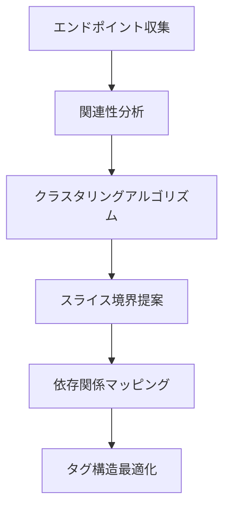

# エンドポイントのグルーピングと API スライス設計

tags: #rtk-query #api-design #endpoint-grouping #slice-architecture

## 概要

RTK Query を効果的に活用するためには、適切な API スライス設計が不可欠です。このコンポーネントは、検出された API エンドポイントを分析し、最適なグルーピングと論理的な API スライス構造を提案します。適切な API スライス設計により、キャッシュの効率性、コード組織化、再利用性が大幅に向上します。

## アーキテクチャ



## コアコンポーネント

### 1. エンドポイント関連性アナライザー

```typescript
interface EndpointRelationshipAnalyzer {
  /**
   * エンドポイント間の関連性スコアを計算
   */
  calculateRelationshipScore(
    endpoint1: EndpointInfo,
    endpoint2: EndpointInfo,
    codebaseContext: CodebaseContext
  ): number;
  
  /**
   * URL パスに基づいたリソース階層の構築
   */
  buildResourceHierarchy(endpoints: EndpointInfo[]): ResourceHierarchy;
  
  /**
   * コード内のエンドポイント共起パターンを検出
   */
  detectCooccurrencePatterns(endpoints: EndpointInfo[]): CooccurrenceGraph;
}
```

### 2. クラスタリングエンジン

```typescript
interface EndpointClusteringEngine {
  /**
   * 関連性に基づいてエンドポイントをクラスタリング
   */
  clusterEndpoints(
    endpoints: EndpointInfo[],
    relationshipScores: RelationshipMatrix,
    options: ClusteringOptions
  ): EndpointCluster[];
  
  /**
   * クラスタの品質メトリクスを計算
   */
  evaluateClusterQuality(
    clusters: EndpointCluster[],
    relationshipScores: RelationshipMatrix
  ): ClusterQualityMetrics;
  
  /**
   * 最適なクラスタ数を推定
   */
  estimateOptimalClusterCount(
    endpoints: EndpointInfo[],
    relationshipScores: RelationshipMatrix
  ): number;
}

interface ClusteringOptions {
  preferredClusterCount?: number;
  minClusterSize?: number;
  maxClusterSize?: number;
  cohesionThreshold?: number;
  domainKnowledge?: DomainConstraints;
}
```

### 3. スライス境界オプティマイザー

```typescript
interface SliceBoundaryOptimizer {
  /**
   * 最適な API スライス境界を提案
   */
  suggestSliceBoundaries(
    clusters: EndpointCluster[],
    codebaseMetrics: CodebaseMetrics
  ): SliceBoundaryProposal[];
  
  /**
   * 提案されたスライス構造の評価
   */
  evaluateSliceProposal(
    proposal: SliceBoundaryProposal,
    metrics: CodebaseMetrics
  ): SliceEvaluation;
  
  /**
   * スライス間の相互作用パターンを分析
   */
  analyzeSliceInteractions(
    proposals: SliceBoundaryProposal[]
  ): SliceInteractionGraph;
}

interface SliceBoundaryProposal {
  name: string;
  description: string;
  endpoints: EndpointInfo[];
  tags: string[];
  estimatedFileSize: number;
  cohesionScore: number;
  couplingScore: number;
  suggestedBaseQueryConfig: BaseQueryConfig;
}
```

### 4. 依存関係マッパー

```typescript
interface DependencyMapper {
  /**
   * エンドポイント間のデータ依存関係を抽出
   */
  extractDataDependencies(
    endpoints: EndpointInfo[],
    codebaseContext: CodebaseContext
  ): DependencyGraph;
  
  /**
   * 最適なキャッシュタグ構造の提案
   */
  suggestTaggingStrategy(
    dependencies: DependencyGraph,
    sliceProposal: SliceBoundaryProposal
  ): TaggingStrategy;
  
  /**
   * キャッシュ無効化パターンの提案
   */
  suggestInvalidationPatterns(
    dependencies: DependencyGraph
  ): InvalidationPatternMap;
}

interface TaggingStrategy {
  providesTags: Map<string, string[]>;
  invalidatesTags: Map<string, string[]>;
  tagDescription: Map<string, string>;
  entityTags: Map<string, string>;
}
```

## 実装戦略

### グルーピング基準

エンドポイントのグルーピングはいくつかの重要な基準に基づいて行われます:

1. **リソースの関連性**
   - 共通のリソース要素（例: `/users/:id` と `/users/:id/profile`）
   - 一貫したエンティティタイプへの操作

2. **機能的凝集性**
   - 特定の機能やユースケースにまとめて使用されるエンドポイント
   - 画面やコンポーネント単位での共起パターン

3. **データ依存関係**
   - 相互に依存するデータを扱うエンドポイント
   - 共通の無効化パターンを持つエンドポイント

4. **更新頻度と安定性**
   - 変更頻度の類似したエンドポイントをグループ化
   - API の安定性に基づく分離

### クラスタリングアルゴリズム

エンドポイントのクラスタリングには以下のアルゴリズムを適用:

1. **階層的クラスタリング**
   - 関連性スコアに基づいたボトムアップのクラスタリング
   - デンドログラムを使用したクラスタ視覚化

2. **セマンティックグルーピング**
   - URL パス構造の解析に基づく階層
   - リソース名と操作の共通性

3. **コード使用パターン分析**
   - 同じコンポーネント内で使用されるエンドポイントの検出
   - 共通のデータ処理パターンを持つエンドポイントの特定

### 最適なスライスサイズの決定

API スライスの最適サイズは次の要素に基づいて決定:

| 要素 | 小さいスライス | 中型スライス | 大きいスライス |
|-----|--------------|--------------|--------------|
| エンドポイント数 | 3-5 | 6-15 | 16+ |
| ファイルサイズ | < 200 行 | 200-500 行 | > 500 行 |
| 責務範囲 | 単一リソース | 関連リソース群 | ドメイン全体 |
| 安定性 | 高頻度変更 | 中程度の安定性 | 非常に安定 |
| タグの複雑さ | 単純なパターン | 中程度の複雑さ | 複雑なパターン |

## タグ設計の最適化

効率的なキャッシュ管理のための RTK Query タグ設計:

```typescript
interface TagDesignOptimizer {
  /**
   * エンドポイントデータの関係性からタグ構造を推論
   */
  inferTagStructure(
    endpoints: EndpointInfo[],
    dataModels: DataModelMap
  ): TagStructure;
  
  /**
   * エンティティベースのタグ設計を提案
   */
  suggestEntityTags(
    dataModels: DataModelMap
  ): EntityTagMap;
  
  /**
   * 最適な粒度のタグ無効化パターンを提案
   */
  optimizeInvalidationGranularity(
    dependencies: DependencyGraph,
    usagePatterns: UsagePatternAnalysis
  ): InvalidationStrategyMap;
}
```

### エンティティベースのタグ設計例

```typescript
// 自動生成されるタグ設計の例
const tagTypes = ['User', 'Post', 'Comment', 'Profile', 'Category', 'Settings'];

// エンドポイントへのタグ適用ルール
const tagRules = {
  'getUsers': { provides: ['User', 'List'] },
  'getUserById': { provides: ['User', { type: 'User', id: 'arg.id' }] },
  'updateUser': { 
    invalidates: ['User', { type: 'User', id: 'arg.id' }],
    provides: [{ type: 'User', id: 'arg.id' }]
  },
  'getPosts': { 
    provides: ['Post', 'List'],
    // ユーザー関連の場合は条件付きタグ
    conditionalTags: (result, arg) => 
      arg.userId ? [{ type: 'User', id: arg.userId, subtype: 'posts' }] : []
  }
};
```

## 出力フォーマット

このコンポーネントは以下の形式で出力を生成:

```typescript
interface SliceDesignResult {
  recommendedSlices: ApiSliceDefinition[];
  tagStructure: TagStructure;
  entityRelationshipDiagram: EntityDiagram;
  sliceInteractionMap: SliceInteractionMap;
  fileStructureRecommendation: FileStructureRecommendation;
}

interface ApiSliceDefinition {
  name: string;
  description: string;
  baseQuery: BaseQueryRecommendation;
  endpoints: EndpointDefinition[];
  tags: string[];
  suggestedFilePath: string;
  cohesionMetrics: CohesionMetrics;
}

interface FileStructureRecommendation {
  files: ApiSliceFile[];
  sharedTypesFile?: string;
  baseQueryFile?: string;
  hookUtilitiesFile?: string;
}

interface ApiSliceFile {
  path: string;
  content: string;
  dependencies: string[];
  exports: string[];
}
```

## 統合ポイント

API スライス設計コンポーネントは次の機能と連携:

1. **タイプシステム** - データモデルとタイプ情報の抽出
2. **コード使用分析** - エンドポイントの共起パターンの検出
3. **依存関係グラフ** - エンドポイント間のデータ依存関係の可視化
4. **コード生成** - 推奨されたスライス構造の実装

## 利用シナリオ

1. **グリーンフィールド設計**: 新規プロジェクトにおける最適なスライス設計の提案
2. **スライスリファクタリング**: 既存の RTK Query 実装の改善提案
3. **段階的移行計画**: 大規模移行のためのスライス境界の段階的定義
4. **スケーラビリティ計画**: 将来の拡張を見据えたスライス設計の評価

## 具体的な出力例

### API スライス設計提案例

```typescript
// 自動生成される API スライス設計の例
export const recommendedApiSlices = [
  {
    name: 'userApi',
    description: 'ユーザー管理関連の API エンドポイント',
    baseQuery: 'fetchBaseQuery({ baseUrl: "/api" })',
    endpoints: [
      { name: 'getUsers', type: 'query', cohesion: 0.92 },
      { name: 'getUserById', type: 'query', cohesion: 0.95 },
      { name: 'updateUser', type: 'mutation', cohesion: 0.88 },
      { name: 'deleteUser', type: 'mutation', cohesion: 0.85 },
      { name: 'getUserProfile', type: 'query', cohesion: 0.82 }
    ],
    tags: ['User', 'Profile'],
    suggestedFilePath: 'src/services/userApi.ts',
    cohesionMetrics: { internalCohesion: 0.87, externalCoupling: 0.34 }
  },
  {
    name: 'contentApi',
    description: 'コンテンツ管理関連の API エンドポイント',
    // 省略...
  }
];
```

## 将来の展望

- **ドメイン駆動設計（DDD）統合**: 境界づけられたコンテキストに基づくスライス設計
- **使用状況ベースの最適化**: 実際のアプリケーション使用パターンに基づくスライス再構成
- **自動適応**: 時間の経過とともに API 利用パターンから学習して設計を改善
- **マイクロフロントエンド互換性**: マイクロフロントエンドアーキテクチャに適した API スライス設計
