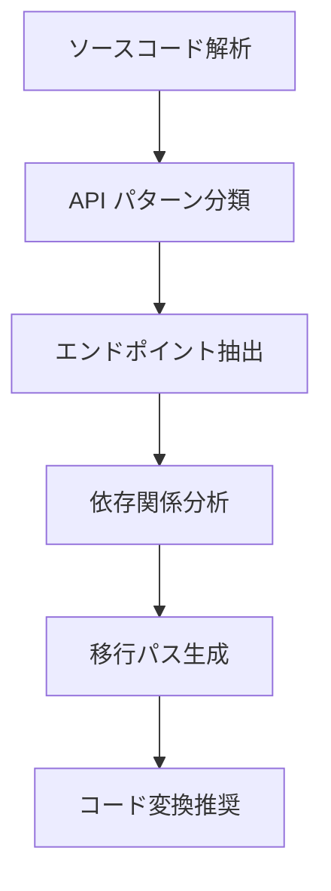

# RTK Query 移行分析エンジン

tags: #rtk-query #migration #analysis #code-transformation

## 概要

RTK Query 移行分析エンジンは、既存のさまざまな HTTP クライアント実装（Axios、Fetch API、カスタム API クライアントなど）から RTK Query への体系的な移行を支援するためのコア機能です。このエンジンは、既存コードのパターンを深く分析し、最適な RTK Query 実装へのパスを提示します。

## アーキテクチャ



## コアコンポーネント

### 1. エンドポイント分類器

```typescript
interface EndpointClassifier {
  /**
   * エンドポイントの種類を分類（クエリ/ミューテーション）
   */
  classifyEndpoint(endpoint: EndpointInfo): {
    type: "query" | "mutation";
    idempotency: "idempotent" | "non-idempotent";
    dataAccess: "read" | "write" | "both";
  };

  /**
   * 関連するエンドポイントをグループ化
   */
  groupRelatedEndpoints(endpoints: EndpointInfo[]): EndpointGroup[];
}
```

### 2. 移行パス生成器

```typescript
interface MigrationPathGenerator {
  /**
   * 単一エンドポイントの移行パスを生成
   */
  generateEndpointMigrationPath(
    endpoint: EndpointInfo,
    context: AnalysisContext
  ): MigrationPath;

  /**
   * エンドポイントグループの移行戦略を作成
   */
  generateGroupMigrationStrategy(
    group: EndpointGroup,
    context: AnalysisContext
  ): GroupMigrationStrategy;
}

interface MigrationPath {
  originalCode: string;
  suggestedRtkQueryCode: string;
  complexityScore: number;
  potentialIssues: Issue[];
  requiredChanges: Change[];
}
```

### 3. 全体的な移行難易度評価

```typescript
interface MigrationComplexityAnalyzer {
  /**
   * 全体的な移行の複雑さを評価
   */
  assessOverallComplexity(
    endpoints: EndpointInfo[],
    codebase: CodebaseMetrics
  ): ComplexityAssessment;

  /**
   * 段階的移行のためのロードマップを提案
   */
  suggestMigrationRoadmap(
    assessment: ComplexityAssessment
  ): MigrationRoadmap;
}

interface ComplexityAssessment {
  overallScore: number; // 0-100 (100が最も複雑)
  factorScores: {
    patternDiversity: number;
    codebaseSize: number;
    interdependencies: number;
    typeComplexity: number;
    stateManagement: number;
  };
  estimatedEffort: {
    personHours: number;
    riskLevel: "low" | "medium" | "high";
  };
}
```

## 実装戦略

### パターン検出アルゴリズム

1. **シグネチャベース検出**
   - 特定のライブラリ関数呼び出しに基づくパターン識別
   - メソッド名と引数構造の分析

2. **データフロー分析**
   - リクエスト発行から応答処理までのデータフローの追跡
   - 状態更新パターンの識別

3. **型情報の活用**
   - TypeScript の型情報を利用した API 構造の推論
   - 型の互換性と変換方法の分析

### 難易度スコアリング

API エンドポイントの移行難易度は次の要素に基づいて算出:

| 要素 | 低難易度 | 中難易度 | 高難易度 |
|-----|---------|----------|---------|
| 実装パターン | 標準的な Axios/Fetch | カスタム抽象化レイヤー | ライブラリミックス |
| 型利用 | 明示的な型定義あり | 部分的な型定義 | any/unknown の多用 |
| 状態管理統合 | 単純な状態更新 | 複雑な状態更新ロジック | 複数ストア連携 |
| エラー処理 | 標準的なエラー処理 | カスタムエラーハンドリング | 複雑なリトライ/回復 |
| キャッシュ要件 | キャッシュなし | 単純なキャッシュ | 複雑な無効化ロジック |

## 出力フォーマット

分析エンジンは以下の形式で出力を生成:

```typescript
interface MigrationAnalysisResult {
  apiDefinitions: RTKQueryApiDefinition[];
  endpointMigrations: Record<string, EndpointMigrationDetail>;
  overallAssessment: ComplexityAssessment;
  migrationRoadmap: MigrationPhase[];
}

interface RTKQueryApiDefinition {
  name: string;
  baseQuery: BaseQueryConfig;
  endpoints: EndpointDefinition[];
  tags: string[];
  recommendedFileStructure: FileStructureRecommendation;
}

interface EndpointMigrationDetail {
  originalCode: string;
  suggestedCode: string;
  affectedComponents: string[];
  migrationSteps: MigrationStep[];
  estimatedEffort: number; // 人時
}
```

## 統合ポイント

移行分析エンジンは次のコンポーネントと連携:

1. **TypeScript コンパイラ API** - 型情報の抽出と解析
2. **AST 解析エンジン** - コード構造と使用パターンの識別
3. **コード生成システム** - 変換された RTK Query コードの生成
4. **プロジェクト設定分析** - 既存の依存関係と構成の理解

## 利用シナリオ

1. **事前評価**: プロジェクト全体をスキャンし、RTK Query への移行の実現可能性と労力を評価
2. **段階的移行**: エンドポイントグループ単位での段階的な移行計画の策定
3. **パイロット変換**: 最も単純なエンドポイントの自動変換による初期成功体験の提供
4. **全体変換**: 分析結果に基づいた全エンドポイントの体系的な移行

## 拡張性

移行分析エンジンは以下のための拡張ポイントを提供:

1. **カスタムパターン登録** - プロジェクト固有のAPIパターンの登録メカニズム
2. **変換ルールのカスタマイズ** - 特定のエンドポイントに対する変換ルールの調整
3. **複数バックエンドサポート** - 複数の API バックエンドが混在する環境での分析

## 将来の展望

- **機械学習ベースのパターン認識** - 繰り返しの分析から学習して精度を向上
- **インタラクティブな移行ガイド** - ステップバイステップの移行プロセスをガイドするウィザード
- **自動テスト生成** - 移行前後の同等性を検証するテストケースの自動生成
