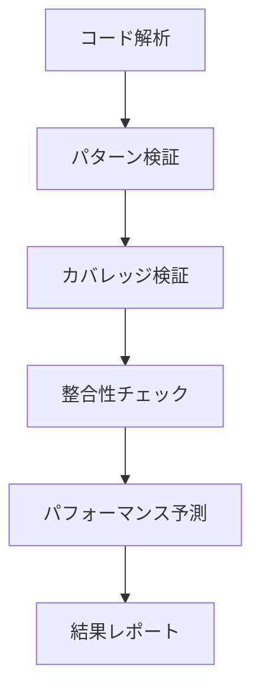

# 実装検証ツール

tags: #rtk-query #validation #testing #quality-assurance

## 概要

実装検証ツールは、RTK Query への移行プロセスの品質を確保するための包括的な検証システムです。自動生成されたコードや手動で修正されたコードの正確性、完全性、およびパフォーマンスを検証し、移行が適切に行われたことを確認します。検証結果に基づいた詳細なレポートとフィードバックを提供することで、移行の信頼性を高めます。

## アーキテクチャ



## コアコンポーネント

### 1. パターンバリデーター

```typescript
interface PatternValidator {
  /**
   * RTK Query ベストプラクティスの検証
   */
  validateBestPractices(
    apiSlice: ApiSliceImplementation,
    options: ValidationOptions
  ): ValidationResult;
  
  /**
   * パターン違反の検出
   */
  detectPatternViolations(
    apiSlice: ApiSliceImplementation
  ): PatternViolation[];
  
  /**
   * 最適化機会の特定
   */
  identifyOptimizationOpportunities(
    apiSlice: ApiSliceImplementation
  ): OptimizationSuggestion[];
}

interface ValidationResult {
  valid: boolean;
  score: number; // 0-100
  violations: PatternViolation[];
  warnings: ValidationWarning[];
  suggestions: OptimizationSuggestion[];
}
```

### 2. カバレッジアナライザー

```typescript
interface CoverageAnalyzer {
  /**
   * API エンドポイントの移行カバレッジ分析
   */
  analyzeEndpointCoverage(
    originalEndpoints: EndpointInfo[],
    migratedImplementation: ApiSliceImplementation[]
  ): CoverageResult;
  
  /**
   * 機能的等価性の検証
   */
  verifyFunctionalEquivalence(
    originalUsage: ApiUsagePattern,
    migratedUsage: RtkQueryUsagePattern
  ): EquivalenceResult;
  
  /**
   * 未移行の API 呼び出しの検出
   */
  detectUnmigratedApiCalls(
    codebase: CodebaseSnapshot,
    migratedImplementation: ApiSliceImplementation[]
  ): UnmigratedApiCall[];
}

interface CoverageResult {
  overallCoverage: number; // 0-100%
  endpointBreakdown: EndpointCoverageBreakdown;
  missingEndpoints: EndpointInfo[];
  riskAssessment: RiskAssessment;
}
```

### 3. 整合性チェッカー

```typescript
interface ConsistencyChecker {
  /**
   * 型の整合性を検証
   */
  verifyTypeConsistency(
    originalTypes: TypeDefinition[],
    migratedTypes: TypeDefinition[]
  ): TypeConsistencyResult;
  
  /**
   * エラー処理の整合性を検証
   */
  verifyErrorHandlingConsistency(
    originalErrorHandling: ErrorHandlingPatterns,
    migratedErrorHandling: RtkQueryErrorHandling
  ): ErrorHandlingConsistencyResult;
  
  /**
   * ビジネスロジックの整合性を検証
   */
  verifyBusinessLogicConsistency(
    originalLogic: BusinessLogicPatterns,
    migratedLogic: RtkQueryTransformations
  ): BusinessLogicConsistencyResult;
}

interface TypeConsistencyResult {
  consistencyScore: number; // 0-100%
  incompatibleTypes: TypeCompatibilityIssue[];
  missingProperties: PropertyMismatch[];
  typeWidening: TypeWideningIssue[];
  narrowingIssues: TypeNarrowingIssue[];
}
```

### 4. パフォーマンスアナライザー

```typescript
interface PerformanceAnalyzer {
  /**
   * キャッシュ効率の分析
   */
  analyzeCacheEfficiency(
    apiSlice: ApiSliceImplementation
  ): CacheEfficiencyAnalysis;
  
  /**
   * リフェッチポリシーの最適性評価
   */
  evaluateRefetchPolicies(
    apiSlice: ApiSliceImplementation,
    usagePatterns: ApiUsagePattern[]
  ): RefetchPolicyEvaluation;
  
  /**
   * 再レンダリングの最適化評価
   */
  evaluateRerenderingOptimization(
    componentUsage: ComponentApiUsage[]
  ): RenderingOptimizationResult;
}

interface CacheEfficiencyAnalysis {
  overallEfficiency: number; // 0-100%
  redundantFetches: RedundantFetchIssue[];
  cacheMissPatterns: CacheMissPattern[];
  optimizationSuggestions: CacheOptimizationSuggestion[];
  taggingEfficiency: TaggingEfficiencyMetrics;
}
```

### 5. テスト生成エンジン

```typescript
interface TestGenerator {
  /**
   * 機能的等価性テストの生成
   */
  generateEquivalenceTests(
    originalCode: ApiImplementation,
    migratedCode: ApiSliceImplementation
  ): EquivalenceTest[];
  
  /**
   * リグレッションテストの生成
   */
  generateRegressionTests(
    apiSlice: ApiSliceImplementation,
    usagePatterns: ApiUsagePattern[]
  ): RegressionTest[];
  
  /**
   * エッジケーステストの生成
   */
  generateEdgeCaseTests(
    apiSlice: ApiSliceImplementation
  ): EdgeCaseTest[];
}

interface EquivalenceTest {
  testName: string;
  originalSetup: string;
  migratedSetup: string;
  assertions: TestAssertion[];
  testCode: string;
}
```

## 検証ルールとヒューリスティック

RTK Query 実装の検証に使用される主要なルール:

### パターン検証ルール

1. **構造的ルール**
   - エンドポイント定義の完全性
   - タグ構造の一貫性
   - 型定義の適切な使用

2. **機能的ルール**
   - 認証処理の適切な実装
   - エラーハンドリングの包括性
   - 並行リクエスト処理の正確性

3. **効率性ルール**
   - 冗長なリクエストの排除
   - 適切なキャッシュ無効化
   - メモ化の効果的な使用

### 整合性検証マトリックス

| 検証項目 | 重要度 | 検証手法 |
|---------|--------|---------|
| 型の互換性 | 高 | 構造的型比較、サンプル値テスト |
| エラー処理 | 高 | パターンマッチング、例外フロー追跡 |
| 認証フロー | 高 | トークン処理の等価性チェック |
| データ変換 | 中 | 入出力サンプルの結果比較 |
| キャッシュキー | 中 | キャッシュキー生成ロジックの検証 |
| ポーリング動作 | 低 | タイミング解析、イベントシーケンス比較 |

## 出力フォーマット

検証ツールは以下の形式で出力を生成:

```typescript
interface ValidationReport {
  summary: {
    overallScore: number; // 0-100
    passStatus: "pass" | "conditionalPass" | "fail";
    criticalIssues: number;
    warnings: number;
    suggestions: number;
  };
  
  detailedResults: {
    patternValidation: ValidationResult;
    coverageAnalysis: CoverageResult;
    consistencyChecks: {
      types: TypeConsistencyResult;
      errorHandling: ErrorHandlingConsistencyResult;
      businessLogic: BusinessLogicConsistencyResult;
    };
    performanceAnalysis: {
      cacheEfficiency: CacheEfficiencyAnalysis;
      refetchPolicies: RefetchPolicyEvaluation;
      renderingOptimization: RenderingOptimizationResult;
    };
  };
  
  issues: Issue[];
  recommendations: Recommendation[];
  generatedTests: GeneratedTestSummary;
}
```

### 詳細レポート例

```javascript
// 自動生成される検証レポートの例
const validationReport = {
  summary: {
    overallScore: 87,
    passStatus: "conditionalPass",
    criticalIssues: 0,
    warnings: 3,
    suggestions: 5,
  },
  
  detailedResults: {
    patternValidation: {
      valid: true,
      score: 92,
      violations: [
        {
          type: "nonOptimalTagging",
          severity: "warning",
          message: "User エンドポイントでエンティティIDベースのタグ指定が最適化されていません",
          location: "userApi.js:45",
          fix: "ID ベースのタグを使用して粒度の細かいキャッシュ無効化を実装してください"
        }
      ],
      // その他の検証結果...
    },
    
    coverageAnalysis: {
      overallCoverage: 96.5,
      endpointBreakdown: {
        // エンドポイント別カバレッジ詳細
      },
      missingEndpoints: [
        {
          path: "/api/users/preferences",
          method: "PATCH",
          risk: "low",
          usageCount: 1
        }
      ],
      // その他のカバレッジ情報...
    },
    
    // その他の詳細結果...
  },
  
  // 主要な問題と推奨事項...
};
```

## 統合ポイント

検証ツールは次のコンポーネントと連携:

1. **ソースコード解析システム** - 実装コードの静的解析
2. **テスト実行環境** - 生成されたテストの実行と検証
3. **コード生成システム** - 検証結果に基づくコード修正提案
4. **レポート生成システム** - 詳細な検証レポートの生成

## 特殊ケース検証

より複雑な RTK Query 使用パターンの検証:

### 1. 条件付きフェッチ

条件付きフェッチパターンの正確な移行検証:

```typescript
function validateConditionalFetch(
  original: ApiUsagePattern,
  migrated: RtkQueryUsagePattern
): ConditionalFetchValidationResult {
  // 条件ロジックの等価性検証
  const conditionEquivalence = checkConditionEquivalence(
    original.fetchConditions,
    migrated.skipConditions
  );
  
  // データ依存関係の検証
  const dependencyCorrectness = validateDependencies(
    original.dataDerivation,
    migrated.selectFromResult
  );
  
  return {
    valid: conditionEquivalence.valid && dependencyCorrectness.valid,
    issues: [...conditionEquivalence.issues, ...dependencyCorrectness.issues],
  };
}
```

### 2. WebSocket/リアルタイム処理

リアルタイム更新処理の検証:

```typescript
function validateRealtimeUpdates(
  original: RealtimeImplementation,
  migrated: RtkQueryRealtimeSetup
): RealtimeValidationResult {
  // 接続管理の検証
  const connectionManagement = validateConnectionLifecycle(
    original.connectionHandlers,
    migrated.setupListeners
  );
  
  // メッセージ処理の検証
  const messageProcessing = validateMessageProcessing(
    original.messageHandlers,
    migrated.onCacheEntryAdded
  );
  
  return {
    valid: connectionManagement.valid && messageProcessing.valid,
    score: calculateWeightedScore([connectionManagement, messageProcessing]),
    issues: [...connectionManagement.issues, ...messageProcessing.issues],
  };
}
```

## 検証プロセスの自動化

検証の自動化と CI/CD 統合:

```typescript
interface ValidationPipeline {
  /**
   * CI パイプラインでの検証実行
   */
  runInCi(
    options: CiValidationOptions
  ): Promise<ValidationReport>;
  
  /**
   * プルリクエスト検証
   */
  validatePullRequest(
    prContext: PullRequestContext,
    options: ValidationOptions
  ): Promise<PrValidationResult>;
  
  /**
   * 差分ベースの検証
   */
  validateDiff(
    codebaseDiff: CodeDiff,
    options: DiffValidationOptions
  ): Promise<DiffValidationResult>;
}
```

## テスト生成戦略

検証プロセスの結果に基づく効果的なテスト生成:

1. **マイグレーション等価性テスト**
   - 入力とサンプルデータに基づく出力一致テスト
   - エラー条件と境界ケースの検証

2. **動作検証テスト**
   - ユーザー操作シーケンスのシミュレーション
   - 非同期フローと状態遷移の検証

3. **パフォーマンステスト**
   - キャッシュヒット率の測定
   - 不要なリフェッチの検出
   - レンダリング最適化の検証

## 利用シナリオ

1. **プレマイグレーション評価**: 移行前の品質および準備度評価
2. **継続的検証**: 移行プロセス中の継続的品質確認
3. **リリース前検証**: リリース前の最終品質ゲート
4. **リファクタリングガイド**: 検出された問題に基づく改善ガイダンス

## 将来の展望

- **ユーザー体験シミュレーション**: エンドユーザー体験への影響予測
- **パフォーマンス回帰検出**: 継続的パフォーマンスモニタリングとアラート
- **学習ベース検証**: 過去の移行パターンから学習した検証ルールの適用
- **自己修復機能**: 検出された問題の自動修正提案と適用
