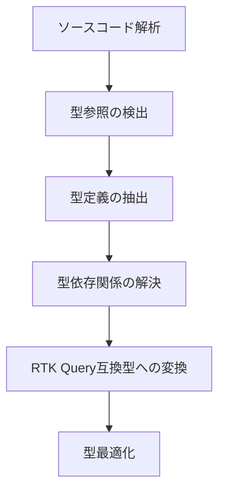

# 型情報の抽出と変換システム

tags: #rtk-query #typescript #type-extraction #type-transformation

## 概要

RTK Query の最大の強みの一つは、TypeScript と完全に統合された型安全なデータフェッチングです。このシステムは既存の API 呼び出しから正確な型情報を抽出し、RTK Query で使用できる型定義に変換します。自動的に変換された型定義により、エンドポイントのリクエスト、レスポンス、クエリパラメータの型安全性が確保されます。

## アーキテクチャ



## コアコンポーネント

### 1. 型参照検出器

```typescript
interface TypeReferenceDetector {
  /**
   * API 呼び出しに関連する型参照を検出
   */
  detectTypeReferences(
    endpoint: EndpointInfo,
    sourceFile: SourceFile
  ): TypeReference[];
  
  /**
   * レスポンス処理から型情報を推論
   */
  inferResponseTypes(
    responseHandling: ResponseUsage[],
    context: TypeContext
  ): TypeInference[];
  
  /**
   * リクエストパラメータから型情報を推論
   */
  inferRequestTypes(
    parameters: ParameterUsage[],
    context: TypeContext
  ): TypeInference[];
}

interface TypeReference {
  kind: "explicit" | "implicit" | "inferred";
  name?: string;
  location: SourceLocation;
  usage: "request" | "response" | "queryArg" | "unknown";
  confidence: number; // 0-1
}
```

### 2. 型定義抽出器

```typescript
interface TypeDefinitionExtractor {
  /**
   * 型参照から完全な型定義を抽出
   */
  extractTypeDefinition(
    reference: TypeReference,
    project: Project
  ): TypeDefinition | null;
  
  /**
   * 型定義の完全な依存グラフを抽出
   */
  extractTypeDependencyGraph(
    mainType: TypeDefinition,
    project: Project
  ): TypeDependencyGraph;
  
  /**
   * インラインで定義された型を抽出
   */
  extractInlineTypes(
    node: Node,
    context: TypeContext
  ): TypeDefinition[];
}

interface TypeDefinition {
  name: string;
  kind: "interface" | "type" | "enum" | "class" | "primitive";
  declaration: string;
  originalLocation: SourceLocation;
  isExported: boolean;
  documentation?: string;
  dependencies: string[];
}
```

### 3. 型変換プロセッサ

```typescript
interface TypeTransformationProcessor {
  /**
   * 型定義を RTK Query 互換形式に変換
   */
  transformToRtkQueryTypes(
    typeDefs: TypeDefinition[],
    options: TransformationOptions
  ): RtkQueryTypeDefinitions;
  
  /**
   * クエリ引数型の最適化
   */
  optimizeQueryArgTypes(
    endpoint: EndpointInfo,
    typeGraph: TypeDependencyGraph
  ): QueryArgTypeOptimization;
  
  /**
   * レスポンス型の正規化推奨
   */
  suggestResponseNormalization(
    responseType: TypeDefinition
  ): NormalizationSuggestion | null;
}

interface TransformationOptions {
  namingStrategy: "preserve" | "prefix" | "suffix";
  namePrefix?: string;
  nameSuffix?: string;
  generateTypeGuards: boolean;
  includeJsDocs: boolean;
  strictNullChecks: boolean;
}
```

### 4. 型アダプタジェネレータ

```typescript
interface TypeAdapterGenerator {
  /**
   * 型互換性アダプタの生成
   */
  generateTypeAdapter(
    sourceType: TypeDefinition,
    targetType: TypeDefinition
  ): TypeAdapter;
  
  /**
   * 変換関数の生成
   */
  generateTransformationFunction(
    sourceType: TypeDefinition,
    targetType: TypeDefinition
  ): TransformationFunction;
  
  /**
   * 型検証関数の生成
   */
  generateTypeValidation(
    type: TypeDefinition,
    options: ValidationOptions
  ): ValidationFunction;
}

interface TypeAdapter {
  adapterCode: string;
  transformFunction: string;
  reverseTransformFunction?: string;
  partialTransformFunction?: string;
  validationFunction?: string;
}
```

## 実装戦略

### 型抽出の精度向上

型抽出の精度を高めるための多層的アプローチ:

1. **明示的型参照の追跡**
   - 型アノテーションと型アサーションの直接解析
   - ジェネリック型パラメータの分析

2. **文脈的型推論**
   - 変数使用からの型情報推論
   - 関数戻り値型の活用

3. **型解決戦略**
   - インポート文の追跡による外部型の解決
   - タイプチェッカーAPIを使用した高度な型解決

4. **ヒューリスティック型推論**
   - オブジェクト構造に基づく型構造の推論
   - 命名規則に基づく型関連の推測

### 型変換の最適化

RTK Query に最適化された型定義の生成:

1. **クエリ引数の最適化**
   - 必須/オプションパラメータの区別
   - パス、クエリ、ボディパラメータの統合
   - 型の交差と合併操作の最適化

2. **レスポンス型の最適化**
   - ネストされたオブジェクトの平坦化オプション
   - 正規化のためのエンティティ識別
   - 変換関数との統合

3. **型の名前付け戦略**
   - RTK Query 規約に準拠した名前付け
   - 名前衝突の解決
   - 名前空間の考慮

### 複合型の処理

複雑な型構造を効果的に処理するための戦略:

| 型構造 | 処理戦略 |
|-------|---------|
| 共用体型 (Union) | タグ付き共用体への変換、型ガード生成 |
| 交差型 (Intersection) | プロパティのマージ、冗長性の排除 |
| インデックス型 | 具体的なプロパティへの展開 |
| 条件付き型 | 静的解析での評価、具体型への解決 |
| ジェネリック型 | インスタンス化された具体型への変換 |

## 出力フォーマット

型抽出システムは以下の形式で出力を生成:

```typescript
interface TypeExtractionResult {
  types: {
    request: TypeDefinition[];
    response: TypeDefinition[];
    queryArgs: TypeDefinition[];
    shared: TypeDefinition[];
  };
  transformations: {
    requestTransforms: TransformationFunction[];
    responseTransforms: TransformationFunction[];
  };
  validations: {
    requestValidations: ValidationFunction[];
    responseValidations: ValidationFunction[];
  };
  rtkQueryTypes: string; // 完全な型定義コード
  typeImports: ImportStatement[];
  normalizationSuggestions: NormalizationSuggestion[];
}
```

### RTK Query 型定義例

```typescript
// 自動生成される型定義の例
export interface GetUserRequest {
  id: string;
}

export interface User {
  id: string;
  name: string;
  email: string;
  role: UserRole;
  preferences?: UserPreferences;
}

export enum UserRole {
  Admin = 'admin',
  Editor = 'editor',
  Viewer = 'viewer'
}

export interface UserPreferences {
  theme: 'light' | 'dark';
  notifications: boolean;
  language: string;
}

// RTK Query エンドポイント型定義
export type GetUserResult = User;
export type GetUsersResult = User[];
export type UpdateUserArg = { id: string; updates: Partial<User> };
export type UpdateUserResult = User;
```

## 統合ポイント

型抽出システムは次のコンポーネントと連携:

1. **TypeScript コンパイラ API** - 型情報の解決と分析
2. **AST 解析エンジン** - ソースコードからの型参照抽出
3. **コード生成システム** - 抽出された型から RTK Query 型定義の生成
4. **RTK Query API 定義生成** - 型定義を実際のエンドポイント定義に統合

## 型推論の強化戦略

正確な型情報がない場合の推論戦略:

1. **構造的推論**
   - オブジェクトリテラルの構造からの型推論
   - API 呼び出しの使用パターンからの型構造推測

2. **名前ベース推論**
   - 変数名や関数名からの型関連の推測
   - 一般的な命名規則の活用

3. **使用ベース推論**
   - 返されたデータの使用方法からの型推論
   - プロパティアクセスパターンの分析

4. **外部ドキュメント活用**
   - OpenAPI/Swagger 定義との統合
   - API ドキュメントからの型情報抽出

## 高度な型変換機能

複雑なユースケースに対応するための高度な機能:

1. **型変換パイプライン**
   - 複雑な型を段階的に変換するパイプライン
   - 中間表現を使った段階的変換

2. **カスタム変換関数生成**
   - 型の不一致を解決するカスタム変換関数
   - ネストされたオブジェクトの変換ロジック

3. **バリデーションロジック**
   - Zod や io-ts のようなバリデーションライブラリとの統合
   - 実行時型チェックコードの生成

4. **正規化ヘルパー**
   - エンティティデータの正規化支援
   - `transformResponse` 関数の自動生成

## 利用シナリオ

1. **既存コードからの移行**: 既存 API クライアントコードから RTK Query 型定義への移行
2. **型定義の拡張**: 既存の型定義をベースにした RTK Query 型の拡張
3. **API 統合の簡素化**: 新しい API 統合のための型定義の自動生成
4. **型安全性強化**: 部分的に型付けされたコードベースでの型安全性の向上

## 将来の展望

- **スマート型推論**: 機械学習ベースの型推論精度向上
- **対話型型抽出**: ユーザーフィードバックに基づく型抽出の改善
- **自動型テスト生成**: 抽出された型の検証用テストの自動生成
- **GraphQL 型統合**: GraphQL スキーマからの型情報抽出と RTK Query との統合
